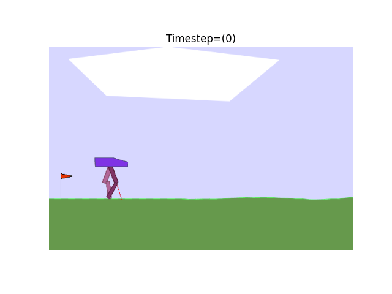

# Gym Box2D Project
## Introduction
This project contains the implementation of reinforcement learning algorithms to solve the Lunar Lander and Bipedal Walker environments using the DQN and DDPG algorithms respectively.

## Environments
### Lunar Lander
<div align="center" float="left">
    
</div>
The Lunar Lander environment is a classic control problem where the goal is to navigate a spacecraft to land on a designated landing pad while avoiding obstacles and minimizing fuel consumption. The observation space is continuous and consists of eight variables representing the position, velocity, and angle of the spacecraft, and the landing pad location. The action space is discrete with four possible actions - do nothing, fire left orientation engine, fire main engine, fire right orientation engine.

---
### Bipedal Walker `(Not solved yet | Work in progress)`
<div align="center" float="left">
    
</div>
The Bipedal Walker environment is a control problem where the goal is to control a 2D bipedal robot to walk and reach the end of a track without falling. The observation space is continuous and consists of 24 variables representing the position, velocity, and angular velocity of the robot and the ground. The action space is continuous with four values representing the torque applied to the two hip and knee joints.

## Dependencies
This project has the following dependencies:

- numpy
- jupyterlab
- matplotlib
- six
- pyglet
- imageio
- imageio[ffmpeg]
- scipy
- PyOpenGL
- gym
- gym[box2d]
- Pillow
- opencv-python
- ipython
- nodejs-bin
- jupyter_contrib_nbextensions
- tensorflow
- ipywidgets
- pandas
- tensorflow_probability

These dependencies can be installed using pipenv with the following command:

## Installation
These packages can be installed by running the following command:
```
pipenv shell
pipenv install --requirements "requirements.txt"
```
to install ipython
```
jupyter nbextensions_configurator enable --user
jupyter nbextension enable --py widgetsnbextension
```

## Project Structure
```css
.
├── img
│   ├── bipedal_walker.gif
│   └── lunar_lander.gif
├── Pipfile
├── Pipfile.lock
├── Lunar_Lander.ipynb
├── Bipedal_Walker.ipynb
├── README.md
├── LICENSE.md
└── requirements.txt
```
## License
This project is licensed under the MIT License - see the LICENSE.md file for details.


## Acknowledgments

- OpenAI Gym
